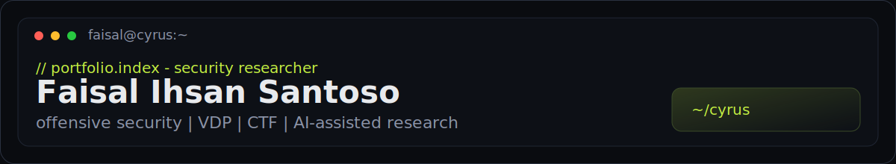

<div align="center">



<br />

[](https://github.com/CyrusSE/Portofolio)
[](https://linkedin.com/in/faisalsan)
[](mailto:faisal15ihsan@gmail.com)
[](https://github.com/CyrusSE)

</div>

---

```bash
$ whoami
faisal@cyrus — security researcher / CTF / VDP

$ cat about.txt
Final-year Information Technology student at Telkom University focused on offensive
security, vulnerability assessment, responsible disclosure, CTF competition, and
AI-assisted security research.
```

## `status --live`

| GPA | CTF | Acknowledgements | Projects | Campus |
|:---:|:---:|:----------------:|:--------:|:------:|
| **3.94** | **20** | **9** | **10** | **13** |

<sub>Counts mirror my portfolio data · Telkom University · Information Technology</sub>

<br />

<table>
<tr>
<td width="50%" valign="top">


</td>
<td width="50%" valign="top">


</td>
</tr>
<tr>
<td colspan="2" align="center">


</td>
</tr>
</table>

## `sections[]`

```text
experience  achievements  acknowledgements  skills  projects  campus  education  contact
```

<table>
<tr>
<td>

**Security Researcher** · penetration testing · responsible disclosure · CTF competition

</td>
</tr>
</table>

## `experience --recent`

| Role | Org | Period |
|------|-----|--------|
| Penetration Tester – Red Team | PuTI · Telkom University | `Mar 2026 – Jun 2026` |
| IT Security – Blue Team | PT. Pertamina Marine Engineering | `Apr 2025 – Sep 2025` |
| Discord Bot Developer | Growtopia utilities · Python / discord.py | `2021 – 2023` |

## `ack --top`

Recognitions from coordinated vulnerability disclosure and security programs:

`NASA VDP` · `BSSN VVIP / Bug Hunter` · `KOMDIGI-CSIRT` · `NTU NSOC` · `PuTI Bug Bounty`

## `ctf --podium`

| Rank | Event |
|:----:|-------|
| 🥇 | CTF Permifest · CTF iTechnoCup 2025 · CTF Adikara 2024 |
| 🥈 | CTF ARA 7.0 · TeknoCom 2026 · Technoskill · Cyber Competition |
| 🥉 | Waskita Manungal Siber · Gunadarma Code Week 2.0 · Rising Phoenix 3.0 |

<sub>+ finalists at PLAY IT 2026, FIND IT!, Hology, GEMASTIK · [full list in portfolio](https://github.com/CyrusSE/Portofolio)</sub>

## `projects --featured`

| Project | Stack | About |
|---------|-------|-------|
| [**agenthop**](https://github.com/CyrusSE/agenthop) | `Go` | Hop AI coding sessions across Claude, Codex, Cursor, OpenCode |
| [**use-skills**](https://github.com/CyrusSE/use-skills) | `Agent Skills` | Quality-first meta-skill — scan, match, fail closed |
| [**Growtopia Internal Cheat**](https://github.com/CyrusSE/Growtopia-Internal-Cheat) | `C++` | ImGui research — hooks, overlays, RE tooling |
| [**CTF Writeups**](https://github.com/CyrusSE/CTF-Writeups) | `Python` | Web · pwn · crypto · forensics · misc |
| [**Portofolio**](https://github.com/CyrusSE/Portofolio) | `React` | This site — terminal hero, glass UI, motion |

<details>
<summary><code>$ ls skills/</code></summary>

<br />

**Languages**  
`Python` `Golang` `C++` `JavaScript`

**Cybersecurity**  
`Ethical Hacking` `Vulnerability Analysis` `Bug Hunting` `AI Pentester` `Reverse Engineering` `Digital Forensics`

**Tools**  
`Linux` `Burp Suite` `Docker` `SIEM` `IDS/IPS` `EDR` `Git` `Postman`

**AI-assisted**  
Cross-language prototyping · exploit research acceleration · code review · documentation synthesis

</details>

<details>
<summary><code>$ campus --leadership</code></summary>

<br />

- **Forensic and Security Laboratory** — lab leadership · [foresty.lab](https://forestylab.com/) · [@foresty.laboratory](https://www.instagram.com/foresty.laboratory/)
- **TelSec** — founder · 400+ member cybersecurity community · [@telsec_telu](https://www.instagram.com/telsec_telu/)
- **PRODIGI Digital Talent Center** — PIC cyber competition · ADIKARA 2025
- Teaching assistant & practicum roles · Informatics Laboratory · Tel-U Faculty of Informatics

</details>

## `connect`

<div align="center">

[](https://github.com/CyrusSE)
[](https://linkedin.com/in/faisalsan)
[](https://forestylab.com/)
[](https://www.instagram.com/telsec_telu/)

<br />

<sub>// end of file · built to match <a href="https://github.com/CyrusSE/Portofolio">Portofolio</a> · palette <code>#0a0c10</code> + <code>#c4f042</code></sub>

</div>
